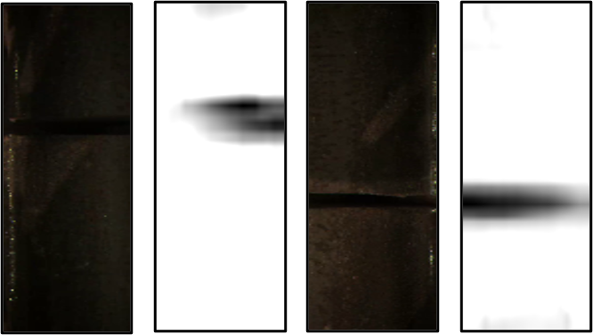
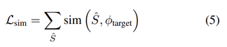
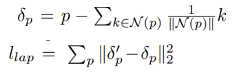
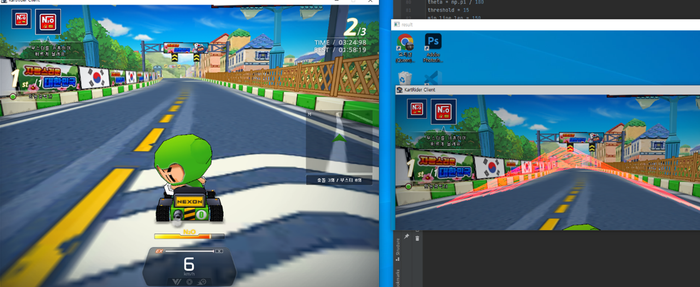

```{=html}
<style>
@font-face {
    font-family: 'NEXON Lv2 Gothic';
    src: url('https://cdn.jsdelivr.net/gh/projectnoonnu/noonfonts_20-04@2.1/NEXON Lv2 Gothic.woff') format('woff');
    font-weight: normal;
    font-style: normal;
}

body{ 
  font-family: 'NEXON Lv2 Gothic';
}

.tab-content{
font-family: 'NEXON Lv2 Gothic';
font-size:17px;
}

.nav-tabs{
font-size:16px;
}

.row{
width:90%;
}
/* Headers */
h1,h2,h3,h4,h5,h6{
  font-family: 'NEXON Lv2 Gothic';
}

h1{
font-size:20px;
}
.figure{
margin:auto;
}

.pages .page img.image-thumb {
max-width: 100%;
}
</style>
```
# **인적사항**

{width="300px"}

Email: [panda726430\@hanyang.ac.kr](mailto:panda726430@hanyang.ac.kr)\
Github: <https://github.com/panda-hh>\

## **학력 정보**

| 학교명       | 캠퍼스 | 주전공     | 부전공   | 입학연월 | 졸업연월 | 졸업상태 |     |
|--------------|--------|------------|----------|----------|----------|----------|-----|
| 한양대학교   | 서울   | 산업공학과 | 물리학과 | 2018.03  | 2023.02  | 졸업     |     |
| 용남고등학교 | \-     | \-         | \-       | 2015.03  | 2018.02  | 졸업     |     |


# **AI 프로젝트** {.tabset}


## **코레일 철도 레일 결함 검지 로봇** {.tabset .tabset-dropdown}

**소속: A2MIND**   
**기간: 2023.07~현재 진행 중**  
**팀 프로젝트**: 2인(AI 알고리즘 담당) 프로젝트  
**연구 주제**:  철도 레일 결함 검지 로봇 체결구 불량 검지 알고리즘 개발   
**역할**:  결함 검지 알고리즘 선정, 논문 구현, 보드 임베딩을 위한 최적화 및 변환, 등 전반적인 연구 직접 참여   

{width="350px"}    
   
   선로를 따라 이동하며 균열이나 열차 운행에 방해되는 방해물을 발견했을 시 영상과 알람을 작업자에게 전송하는 인공지능을 활용한 레일봇 개발<a href="https://www.yna.co.kr/view/AKR20231205099300063">(기사 링크)</a>에서 결함 검지 알고리즘 개발에 참여하였습니다.제가 주 연구자로 참여하여 개발한 본 알고리즘을 탑재한 철도 로봇은 2023년 12월 국토교통부가 주관하는 2023 대국민 철도안전혁신대회에서 최우수상을 수상<a href="https://www.redaily.co.kr/news/articleView.html?idxno=6991">(기사 링크)</a>하였습니다.   

### **체결구 불량 감지** 
{width="400px"}    
   
 Object Detection 모델(YOLO 기반)만을 활용하여 체결구의 불량감지를 한 번에 하는 방식과, Object Detection 모델을 통해서 체결구의 위치 탐지 작업을 선제적으로 진행한 뒤 그 영역을 crop하여 anomaly detecion 모델을 통해 불량을 검지하는 앙상블 모델 방식, 총 2가지를 구현 및 비교하였습니다. 두 가지 방식 중 속도와 정확도가 높은 모델로 선정하였고 이를 Orin NX 보드에 임베딩시키기 위해 경량화 및 최적화가 필요했습니다. 이를 위해 Nvidia Hardware에 최적화하는 TensorRT로 convert, Quantization을 활용하였으며 TensorRT 모델을 보드에서 inference할 수 있도록 코드를 작성하였습니다.   
결과적으로 Orin NX 보드에서 실시간성을 보장할 수 있는 fps 40과 좋은 검지율로 볼 수 있는 mAP 0.95 이상을 달성하였습니다.


### **철도 레일 결함 감지-Crack**
  {width="300px"}      
     
Unsupervised anomaly detection 모델을 활용하여 선로에 crack이 있는지 검사하는 알고리즘을 개발하였습니다. 연산 효율성과 정확도가 높은 두개의 모델을 선정하여 모델간의 성능 비교를 진행하였으며, 온보딩하여 성능과 속도가 뛰어난 모델을 선정하였습니다. 선정된 모델은 Input 해상도가 640×640으로 고정되어 보드에서 돌리기에는 실시간성을 유지하기에 속도가 낮았습니다. 이에 성능과 속도 간의 Trade-off를 비교 실험하였고 최종적으로 128×128의 해상도로 선정하였습니다. 이 과정에서 해상도뿐만 아니라 모델의 Auto-Encoder의 크기 조절을 실행하였습니다.   
알고리즘을 Nvidia의 보드인 Orin NX상에 임베딩시키기 위해 TensorRT로 convert 및 quantization을 통해 모델 경량화를 진행하였고 최종적으로 batch size=2로 fps 40-50의 속도와 mAP 0.98이상의 성능을 달성하였습니다.   
   
  {width="350px"} 

## **실버 가드(요양원 관리 프로그램)**
**소속: A2MIND**   
**기간: 2023.09~현재 진행 중**  
**팀 프로젝트**: 2인(AI 알고리즘 담당) 프로젝트  
**연구 주제**:  요양원 낙상 및 욕창 감지 알고리즘 개발   
**역할**:  Pose estimation, 자세 추정 판단, 알고리즘 선정, 논문 구현, 보드 임베딩을 위한 최적화 및 변환, 등 전반적인 연구 직접 참여   
{width="350px"}    
   
독거 노인 및 요양원에 계신 노인분들의 욕창과 낙상을 감지하여 이를 알리는 시스템의 알고리즘을 담당하여 진행하였습니다.<a href="http://www.carekim.com/news_view.jsp?ncd=1205">(기사 링크)</a>   실버가드에는 주야간 낙상 및 낙상 가능성을 자동탐지하고, 체온, 맥박 및 호흡을 탐지하여 건강상태를 모니터링하며, 욕창방지를 위하여 자세를 자동탐지하거나 자세의 지속시간을 탐지하여 요양사에게 실시간으로 알려주는 기능을 구현하고 있습니다. 그 중에서, 낙상 및 낙상 가능성 탐지 및 욕창 방지를 위한 자세와 지속시간 탐지 기능의 알고리즘을 맡아서 진행하고 있습니다.   
   
   
### 낙상 감지   
{width="350px"}    

낙상 감지를 위해 침대의 위치에서 벗어난 채로 노인이 누워있다면 낙상으로 정의하였습니다. 이를 위해서 딥러닝 기반의 **Pose estimation**(YOLO v8 기반과 Coral에서 제공하는 Pose-NET과 성능 비교) 알고리즘을 통해 신체의 키포인트들을 추출합니다. 이 과정에서 현장에서 수집한 데이터로만 학습한 모델과 COCO dataset을 활용해 사전 학습을 한 뒤 학습한 모델 중 어떤 것이 성능이 더 좋은지 비교 분석을 진행하였습니다. 이렇게 학습한 모델을 통해서 추출된 key points를 활용해서 key points 정보를 기반으로 직접 조건을 정의하는 Rule-based 방법론과, 자세를 예측할 수 있는 딥러닝 모델들 중 keypoints만을 input으로 하는 모델, key points와 함께 image를 input으로 받아 자세를 판단하는 모델을 모두 구현 및 비교 연구 진행하였습니다. 추가적으로, 이불이 덮어져 있을 때를 대비한 Pose estimation 또한 구현하였습니다.
   추출된 key points를 활용하여 **자세 판단**을 하는 모델 같은 경우, 비교 연구를 진행한 모델들을 중 가장 성능이 좋았던 flatten한 key points와 이미지를 통해 자세를 판단해주는 딥러닝 모델을 사용하였습니다.   
   {width="300px"}     
   
   욕창 방지를 위해서 **Head pose estimation 모델**을 활용하여 한 쪽 방향으로 너무 오랜 시간 동안 누워있지 않은지 판단할 수 있는 알고리즘 또한 개발하였습니다.   
   TPU를 활용하는 coral board를 통해서 프로젝트가 진행되고 있었기에 int 8 형식의 연산을 사용하는 coral board에 맞게 임베딩 시키기 위해 모델들을 convert 하는 작업을 진행하였습니다. Coral board에서 batch-normalization 연산을 지원하지 않기에 batch-normalization 연산을 architecture reparameterization을 통해서 대체한 RepVGG backbone을 사용하였습니다. 
   {width="450px"}   
 
   그리고 사용했던 논문이 torch 모델을 tflite 모델로 그대로 convert 하면 input에 배치가 달라 연산하는 과정이 추가되어 비효율이 발생하여 이를 방지하고자 pytorch 프레임워크로 짜여진 기존 논문의 코드를 학습 과정부터 tensorflow 프레임워크로 다시 코드를 작성하였습니다. 그렇게 Rep-VGG back bone을 기반으로 만들어진 모델을 변환하여 성능을 확인했을 때 성능하락이 너무 컸고 이에 대한 원인을 architecture reparameterization 기법을 int8로 quantization 하는 과정에서 parameter 손실이 너무 크다고 판단하였습니다. 이를 해결하기 위해 Rep-VGG inference model을 convert 할 때 optimization reparameterization 기법을 활용하기로 결정하였고, 이를 구현했을 때 아래와 같이 개선된 결과를 보였습니다.   
   {width="600px"}    
   {width="600px"}    
   
## **가상 데이터 생성 툴**  
**소속: A2MIND**  
**기간: 2023.07~현재 진행 중**   
**팀 프로젝트**: 3인(AI 알고리즘 담당) 프로젝트  
**연구 주제**: 딥러닝 학습 데이터를 가상생성을 위한 3d mesh생성  
**역할**: text,이미지 기반 3d mesh 생성 알고리즘 선정 및 최적화  

Image augmentation의 일환으로 AI로 생성된 3d 데이터를 학습에 활용하여 성능을 높이는 프로젝트를 진행하였습니다. 현재까지 3d mesh asset 생성을 위해 GAN기반 알고리즘 GET3D와 단일 이미지로 생성하는 알고리즘들인 Pixel2Mesh, DINAR, PIFU, I2L-MeshNet, text기반 멀티모달인 text2mesh,x-mesh등의 알고리즘들을 사용하여 여러 3d asset을 생성하여 비교하였습니다. 특히 Deformable한 사람을 생성하는 것에 집중하였습니다. 우선 이미지에서 키포인트 값과 몸의 형태 값을 추론해 3D 인체 형상과 포즈를 파라미터화하는 모델인 smpl에 적용하였습니다. 그리고 사진에서 안 보이는 영역에 대한 생성 성능을 더 높이기 위해 DDPM 등의 최신 기술 적용으로 키와 몸무게 성별을 정하고 얼굴과 연령, 원하는 옷 스타일을 입힌 가상 생성된 사람 에셋을 구축하는데 성공하였습니다.  

   {width="700px"}    
   
   
## **대전수소트램**  
  
**소속: A2MIND**  
**기간: 2024.01~현재 진행 중**  
**팀 프로젝트**: 3인(AI 알고리즘 담당) 프로젝트  
**연구 주제**: 대전 수소 트램 운전자 경고 알람 서비스  
**역할**: drive zone segmentation, object detection, tracking 알고리즘 선정, 논문 구현, 보드 임베딩을 위한 최적화 및 변환, 등 전반적인 연구 직접 참여  
  
대전시에서 곧 선보일 트램에서 트램의 주행경로에서의 사람, 자동차 등의 장애물에 대한 운전자 경보 알람 서비스를 맡아 알고리즘을 개발하고 있습니다.  
tram주행 경로에 대한 segmentation과 장애물 탐지 detection을 진행하고 있으며이를 multitask로 수행하는 연구들을 적용하여 nvidia board에서 실시간성을 보장하며 성능 90%이상을 보이고 있습니다.  

## **'열연공정 표면 결함 검출의 머신러닝 알고리즘 비교' 학위논문**
  
**기간: 2022.03~2022.06**  
**팀 논문**: 4인팀 논문  
**논문 주제**: 공정 불량품 검출에서의 딥러닝 활용에 대한 알고리즘 비교 및 개선  
**역할**: 다양한 알고리즘에 실제 검사 공정에서 쓰이는 유형의 데이터셋을 적용하여 성능을 확인하고 하이퍼파라미터값을 조정하며 모델의 성능을 향상시켰습니다.  
**사용한 알고리즘**: EfficientNET, Vision Transformer(ViT), Support Vector Machine(SVM), Random Forest  
**보고서 링크: <a href="Graduate_Thesis/Graduate_thesis.html" target="_blank">새 창에서 RMarkdown으로 작성된 논문 열기</a> **  
**논문 및 코드 링크**: <a href="https://github.com/panda-hh/Paper">https://github.com/panda-hh/Paper</a>
  <br>
  <br>
  <br>
  <br>
기존에 딥러닝 Classification 모델의 성능을 평가하는 대표적인 이미지 데이터셋인 ImageNet, CIFAR, 등은 주로 일상생활에서 접하기 쉬운 개, 고양이, 자동차, 비행기, 등을 분류하는 문제입니다. 하지만 실제 현장에서는 적은 종류의 레이블을 가지고 결함과 같은 이미지 내의 작은 특징을 통해서 이미지를 분류하는 경우가 대다수이기 때문에 이러한 이미지 데이터셋을 기반으로 하는 연구들을 활용하여 모델에 적용, 학습하였을 때 기대한만큼의 성능을 내지 못할 수 있습니다. 특히 검사 공정에서 불량 이미지 같은 경우 구하기가 한정되어 있기 때문에 적은 데이터로도 높은 성능을 내는 딥러닝 모델을 활용하는 것 또한 고려되어야 합니다. 또한 머신러닝을 공장에 초기 도입할 때 모델의 초기 하이퍼파라미터 세팅값들에 대한 조절도 필요합니다.

{width="700px"}

이에 본 연구에서 열연공정 중 발생한 금속 표면 결함 검출을 위한 머신러닝 모델들을 비교하였습니다. 철 표면 데이터 1800장을 사용하였고 성능지표를 만들어 각 모델을 테스트하였습니다. 실험결과, EfficientNet에서 하이퍼파라미터 값은 Batch size: 16, Shuffle Buffer size: 128, Epoch: 100, Optimizer: Adam, Learning Rate: 1e-2일 때 accuracy 값이 99.72%로 가장 좋은 성능을 보였습니다. 이는 기존에 잘 알려져 있어 많이 사용되고 있던 SVM보다 30.28%p 높은 성능이며 Random Forest보다 21.39%p 높았습니다. 또한 발표되자마자 높은 성능으로 각광을 받은 Vision Transformer보다 2.22%p 높은 성능입니다. EfficientNet은 결론적으로 2차원 이미지 결함검사에서 철강 표면 결함 검사 공정에서 300장의 제한된 이미지 데이터셋을 분류하는 데 EfficientNet이 가장 적합하다고 볼 수 있었습니다.

{width="500px"}
<center>**<그림: 각 알고리즘에서 가장 성능이 좋았던 모델들의 성능지표>**  </center>  
   
많은 데이터를 얻기 힘든 실제 공장에서, EfficientNet은 상대적으로 적은 데이터에서도 높은 정확성을 낼 수 있어 유용합니다. 기술의 사용으로 결함 검사뿐만 아니라 결함 추적, 표면 마무리 검사, 부품들의 결합 검사 등의 수행도 가능할 것입니다. 이는 사이클 타임의 감소와 품질 향상에 기인하여 대한민국 제조업의 성장을 주도할 수 있습니다.
앞으로 향후 발표되는 기술과 EfficientNet과의 지속적인 비교 연구를 진행하여야 할 것입니다. 특히, 가장 최적의 성능을 보이는 모델을 찾아 채택하여 검사 공정에 적용해 인건비를 감소시키고 불량 검출률을 향상할 방법을 연구할 것입니다. 우리는 이러한 연구를 통해 추후 품질 향상과 인건비 감소로 인한 제조업 환경 변화에서 경쟁 우위를 차지하고 공정 전반의 효율을 높이는데 기여할 것을 기대합니다. 


## **StyleGAN Style-Mixing 개선 연구**
  
  
  **기간: 2022.09~2022.12**  
**팀 프로젝트**: 5인 프로젝트  
**연구 주제**: StyleGAN의 network 구조 변경 후 생성 데이터의 주관적 성능 평가    
**역할**: 팀에 딥러닝 프로젝트 경험이 없는 학생들이 대부분이어서 논문리뷰, 연구, 코드작성, 보고서작성을 전방위적으로 이끄며 프로젝트를 진행하였습니다.  
**보고서 링크: <a href="StyleGAN_research/StyleGAN_research.html" target="_blank">새 창에서 RMarkdown으로 작성된 보고서 열기</a> **  
**코드 링크**: <a href="https://github.com/panda-hh/StyleGAN_Research">https://github.com/panda-hh/StyleGAN_Research</a> 
  <br>
  <br>
  <br>
  
{width="350px"}\  

<br> Style vector를 기반으로 이미지를 생성하는 모델인 style-Based Generator Architecture for Generative Adversarial Networks(이하 style-GAN) 구조를 이해하고 관련 논문에서 사용한 데이터셋(FFHQ) 외에 CelebA-HQ, 특징을 가진 인물들을 직접 분류한 데이터셋, 고양이, 자동차 등 다양한 데이터 셋에서 style-GAN의 성능을 파악하였습니다. 더불어, style mixing 과정에서 style vector가 삽입되는 위치를 다양하게 변환하여 기존 style-GAN 논문에서 제안하는 방식과 본 연구에서 제안하는 방식 모두에 대해 주관적인 성능 평가를 진행하였습니다. 나아가서, style mixing 시에 각각 다른 데이터셋으로 학습된 mapping network를 거친 두 개의 latent vector w를 하나의 synthesis network에서 합성해보는 시도를 통해서 다양한 style mixing에 대한 성능평가 또한 진행해보았습니다.

{width="100%"}
{width="100%"}

  <br>
  결론적으로, style-GAN은 논문에서 이야기한대로 고해상도이며 데이터의 개수가 많은 데이터셋인 FFHQ, CelebA-HQ에 대해서는 style-GAN이 좋은 성능을 보였습니다. 하지만, 데이터의 수가 1,657,266 장으로 굉장히 많은 LSUN Cat dataset에 대해서는 학습을 할 때 레이블링이 없고 비지도학습으로서 학습이 되는 GAN 모델의 특성 상 공통되는 고양이의 특징을 통해 사실적인 이미지를 생성하는 데 어려움을 보이는 모습을 보였습니다. 하지만, 데이터들의 구도와 형태가 유사하면서 데이터가 많은 자동차 데이터셋 같은 경우에는 상대적으로 좋은 성능을 보임을 확인할 수 있었습니다.  
  GPU 메모리나 학습 시간이 제한된 학습 환경에서 학습된 네트워크에서의 생성 결과를 살펴보면, 이미지 데이터가 충분한 경우에는 학습 진행도가 비교적 적고 해상도가 낮더라도 훨씬 더 사실과 같은 이미지를 만들어냈습니다. 하지만 이미지 데이터가 적은 경우에는 학습 진행도가 많이 진척되었고 해상도가 앞선 네트워크보다 높은 수준까지 진행이 되어 높은 해상도의 이미지를 생성하더라도, 마치 해상도가 낮은 사진처럼 형체를 알아보기 힘들거나 특징을 제대로 반영하지 못한 경우가 대부분이었습니다. 
  또한, 기존 style-GAN 논문에서 제안하는 합성 방법인 coarse style, middle style, fine style을 통한 합성 방법과 본 논문에서 제안하는 합성 방법의 성능을 비교해보았습니다. 기존 style-GAN 논문에서 제안하는 합성 방법은 두 스타일이 합쳐질 때 특징마다 둘 중 하나의 스타일을 채택하여 조합이 되는 결과를 보이는 반면, 본 논문에서 제안하는 방법은 각 특징마다 두 스타일을 적절히 섞어 중간 정도의 결과를 보였습니다. 이러한 결과는 FFHQ, CelebA-HQ 데이터셋 뿐만 아니라 자동차 데이터셋이나 제한된 환경에서 학습된 네트워크들에서도 동이라게 나타났습니다. 이에 더해, 기존에도 사실적인 이미지를 잘 생성해내지 못하는 LSUN Cat Dataset을 통해 생성된 네트워크 같은 경우에는 style mixing에서도 좋지 못한 성능을 보임을 확인할 수 있었습니다.
  마지막으로는 서로 다른 데이터셋으로 학습된 두 개의 다른 mapping network를 거친 latent vector들을 하나의 synthesis network에서 합성하는 실험을 해보았습니다. FFHQ와 CelebA-HQ와 같이 특징이 유사하고 잘 학습된 네트워크의 경우에는 서로 다른 mapping network를 통과하더라도 이미지 생성 시에 좋은 성능을 보였습니다. 하지만 LSUN Cat 데이터셋을 통해 학습된 mapping network를 지나 FFHQ 데이터셋을 통해 학습된 synthesis network를 지났을 때는, wrapping이나 entanglement와 같은 문제가 발생하여 특징을 구체적이고 사실적으로 생성해내지 못했습니다. 이를 통해서 적절하게 학습된 mapping network를 통해야 좋은 성능을 보임을 확인할 수 있었습니다. 또한 mapping network가 entanglement와 wrapping 문제를 해결하는 데 기여하고 있음 또한 확인하였습니다.  
<br>

# **AI 논문 리뷰** {.tabset}


## X-Mesh: Towards Fast and Accurate Text-driven 3D Stylization via Dynamic Textual Guidance   
**X-Mesh: Towards Fast and Accurate Text-driven 3D Stylization via Dynamic Textual Guidance**
ICCV 2023   

### Introduction  
•	기존의 text2mesh를 improve한 형태.  
•	기존의 text2mesh는 CLIP을 활용할 때 textual guidance가 부족하다는 점을 지적.  
•	Text-guided Dynamic Attention Module (TDAM)을 propose함.  
•	TDAM은 Forward과정에서 Spatial attention과 Channel attention을 주는 역할.  
•	기존의 Text2Mesh와는 다르게, mesh의 local 영역들에 대해서 detail한 controllability를 가지게 됨.  


### Text2Mesh (top) vs X-mesh (bottom)  


  
  
### Components of X-mesh  
•	기본적으로 Text2Mesh의 형태를 거의 그대로 따르고 있음.  
•	Positional offset을 vertex normal이 아니라 xyz방향 모두에 대해 학습.  
•	Positional offset의 norm은 0.1이하로 clamp함.  
•	Positional Encoding과 Loss term 은 Text2Mesh와 완전히 동일  

{width="350px"}
{width="350px"}
{width="350px"}

### Text-guided Dynamic Attention Module  
  
•	TDAM은 text-related vertex attention을 만듦.  
•	Channel방향, Spatial 방향 양면으로 만듦.  
•	Attention을 매기는 방식은 CBAM, SENet 등 과 유사한 방식.  
•	대신 자기 자신의 feature만 사용하는게 아니라 textual feature도 함께 사용.  

**[SENet]**  

**[CBAM]**


### Dynamic MLP  
•	Dynamic MLP    
  
•	겉보기엔 일반 MLP와 다를 바 없지만, 여기서 파라미터 W_t가 direct parameter optimization방식이 아니라 generate되는 방식.

  
  

### Channel, Spatial Attention  
  
  
•	η_1, η_2 는 각각 Dynamic MLP 1, 2.  
•	Not shared-parameter   
  
  
Image augmentation의 일환으로 AI로 생성된 3d 데이터를 detection 학습에 활용  

### X-mesh의 강점 (개인적 견해)  
1.	Text2Mesh는 CLIP Loss를 통해서 Mesh를 Directly optimize하는데, 이 때 CLIP 에선 각각의 다른 Sentence와 Image 전체에 대해서 similarity를 낮추기 때문에 local-controllability가 약함.  
•	 CLIP 은 (body vertex의 특정 영역) vs (text들의 특정 단어)가 잘 매칭되도록 학습하는 방식이 아니라, (vertex 전체) vs (text 전체) 의 방식.    
•	실제로 실행해보면, text2mesh는 Steve jobs, iron man등 대명사들에 대해서는mesh를 곧잘 만들지만, detail한 order을 전달했을 경우에는 상당히 성능 저하가 발생함.   
•	Text2Mesh는 전체 style은 잘 전달해도 Content-aware하게 stylization 하는 것을 잘 못하는데, X-Mesh는 이 부분을 TDAM의 Attention이 어느정도 담당해준다는 추측.   
•	CLIP encoder들 내에서도 content-aware하게 Attention을 주는 것이 가능하다면 훨씬 더 나아지지 않을까?   
2.	논문에서 언급하지 않았지만, Text2mesh는 random-crop을 강하게 하는 것과는 다르게, X-mesh는 항상 rendered된 이미지 전체를 image encoder의 input으로 사용.   
•	Crop을 한다면 local에 대한 description만을 Clip에 전달할 수 있는게 아니기 때문에 Clip loss의 특성과 맞지 않아서  text2mesh 와 호환이 좋지 않다고 생각하여 crop 안 것으로 추측.   

### Results
  

### My Result  
  


## DINAR: Diffusion Inpainting of Neural Textures for One-Shot Human Avatars  
**DINAR: Diffusion Inpainting of Neural Textures for One-Shot Human Avatars**  
ICCV2023  
  
### Introduction  
  
Generate avatars of previously unseen people from single images  
  
### Method   
1. Avatar generation model  
input image로부터 neural texture 만들기(seen region)  
Texturing operation   
Neural rendering   
2. Inpainting model  
Restore body areas unpresented in the input image.  
(Denoising diffusion probabilistic model (DDPM) 기반)  
Avatar generation model train하고 train  
  
### Avatar generation model  
1. SMPLifyX와 segmentation loss를 이용하여 smpl-X fitting과 RGB image Input  
2. Make L-channeled neural texture T   
3. Resterizer R(T, M, Ctarget) : T와 mesh를 L-chanel의 rasterization  
4. Render : RGB+mask output  

•	SMPL-X fitting  
•	SMPLifyX이용  
   -> openpose 이용  
•	Custom uvmap 사용  
•	뒷면이 잘린 기존의 uvmap이 아닌 앞면이 잘린 uvmap사용  
•	Unseen 영역에 대한 생성을 잘 할 수 있도록    

  

•	Make Neural texture (256\*256\*21)  
->16channel  
stylegan2 discriminator architecture(encoder) + generator architecture  
->RGB channel  
->binary channel 2개(sampled pixels,sampled and inpainted pixel)  

  
  


•	Rasterization R(T, M, Ctarget)  
[minimal_pytorch_rasterizer]  
•	CUDA non-differentiable mesh rasterization library for pytorch tensors with python bindings.  
•	Projects mesh to image using pinhole camera model  
•	Vertices could have any number of features (channels).  
•	Library also estimates normals for mesh visualization.  
•	Renderer (θ(R(T, M, Ctarget)))  
rasterized image with (L+3+1+1) channels into Irend output RGB image  
U-Net architecture with ResNet blocks  

{width="200px"} 

•	Train  
renderer θ , neural texture encoder E , generator G  
  
  
IGT : different camera parameters and different body pose parameters   
	 (modules learn to inpaint small fragments unseen in Irgb)
  

Dice loss-> Mask loss  
Adversarial loss styleGan discriminator with R1regularization   
  
### Inpainting model    
   
Texture inpainting   
1. Compressed neural textures (VQGAN)    
2. Inpainting using DDPM  
•	Reducing texture space  
T resolution (256 × 256 × 21) leads to a huge memory   requirements during the diffusion model training  
•	VQGAN 사용  
•	Train  
VQGAN만 학습시키고 전체 네트워크에 붙인 후 finetuning  
**[Loss]**  
L2 loss in texture space   
||T −Tres||2 2   
     

### Texture inpainting   
DDPM    
using the merged textures as ground truth  
  
  

### Inference
•	Apply technique to improve avatar quality   
•	Reduce the impact of SMPL-X fitting imperfections : detect areas of human self-occlusion in the input image  
•	겹쳐진 윤관을 따라 texture가 sampling 안하도록   
   
  
### Training  
[Avatar generation]  
2D images obtained diverse by rendering Texel dataset
13,000 people in poses  
segmentation mask  : using Graphonomy   
SMPL-X parametric model : using SMPLify-X.   
[Inpainting model]  
renders from Texel dataset  
3333 human scans from the Texel dataset  
rendered each scan from 8 different views to get a multiview dataset  
  
### Evaluate  
•	Dataset : AzurePeople dataset, snapshotPeople  
  
  
  
  

### My Results  
  
  


## PIFu: Pixel-Aligned Implicit Function for High-Resolution Clothed Human Digitization
**PIFu: Pixel-Aligned Implicit Function for High-Resolution Clothed Human Digitization**

### Introduction  
•	PIFu는 end-to-end 방식으로 deep learning을 통해 옷을 입은 사람을 찍은 단일 이미지 또는 여러 방향에서 찍은 둘 이상의 2D 이미지만을 가지고 3D surface와 texture를 추론하여 그 사람을 표현하는 3D model을 예측할 수 있는 모델이다. 
•	PIFu는 픽셀 수준의 개별적인 local feature를 전체 물체의 global context에 fully convolutional 방법으로 align하기 때문에 높은 메모리 사용량을 필요로 하지 않는다. 

   
  
### Related works  
  
•	template model을 기반으로 이미지로부터 사람의 feature 또는 attribute를 추출해서 파라미터를 확률적으로 조절하는 방법으로 구현한 것이다.  
•	 사람의 체형, 자세 등 사람을 표현할 수 있는 정보에 관한 parametric model은 많이 사용되지만 머리카락이 없고 옷, 액세서리를 착용하지 않은 naked-human body에 관해서만 높은 표현이 가능하다.   
•	Pifu는 Template-based가 아닌 3D reconstruction에 관한 implicit function을 모델링하는 neural network를 사용  

 

### Pipe Line  
•	이미지의 각 pixel에서, 그 위치에 관련된 global context를 고려하여 개별 feature vector를 학습하는 encoder를 학습   
•	 이 per-pixel feature vector와 이 픽셀에서 나아가는 specified z-depth가 주어지면 implicit function을 학습  
•	 이 implicit function은 해당 z-depth에 대응하는 3D point가 surface의 안에 존재하는지 밖에 존재하는지를 분류   
•	 pixel-aligned implicit function은 fully convolutional image encoder와 MLP로 표현된 continuous implicit function인 으로 구성  
  
   

### Depth value  
•	3차원 좌표의 depth value는 3차원 좌표와 그 이미지를 찍은 calibration matrix를 받아서 구한다.   
•	Calibration matrix는 카메라 내부의 intrinsic parameter와 3D space 상에서의 기준점과 카메라를 찍은 위치와의 선형변환 관계를 나타내는 extrinsic parameter를 지니고 있다.  
   
  
###  Single-View Surface Reconstruction   
  
  
  

pixel-aligned implicit function인 fv를 MSE의 평균을 최소화하는 방향으로 학습시킨다  
함수 fv∗ : 3차원 좌표에 관한 실제 3D occupancy인 ground truth  
f는 그 좌표에 관하여 implicit function인 f에 대응되는 MLP의 예측 결과 출력.  

### Spatial Sampling  
  
{width="350px"} 
공간에서 균일하게 샘플링한다면 대부분 point가 iso-surface에서 멀어서 네트워크의 outside 예측을 가중시킴.  
 iso-surface 주변만 샘플링하는 것은 오버피팅을 야기.  
  surface geometry에 기반하여 uniform 샘플링과 adaptive 샘플링을 합친다. 먼저 surface geometry에서 무작위로  샘플링하고 x,y,z축에 대해 정규 분포 N (0, σ)로 offset을  더해줌. 이 샘플들을 16:1 비율을 사용한 bounding box 내에서 균일하게 샘플링한 포인트와 합친다.  
 
### Single-View Surface Reconstruction  
3D 공간에서 probability field를 샘플링하고 probability field에서 Marching Cube 알고리즘을 사용하여 임곗값 0.5로 iso-surface를 추출한다.   
  

### Textrue Inference  
  
  
  
C(Xi) : surface point인 Xi ∈ Ω에서의 GT RGB 값
N : 샘플링된 point 개  
fc가 surface의 RGB 값 뿐만 아니라 물체의 3D surface 또한 학습방지를 위해 image feature인 Fv를 같이 넣어준다. 색상 추론에 집중할 수 있게 해주었다.  
 surface의 법선 N을 따라 surface 포인트에 offset을 도입해서 색상이 정확한 surface 뿐만 아니라 주변의 3D 공간에도 정의될 수 있도록 하여 오버피팅 방지.  

### Multi-View Stereo  
기존의 implicit function을 두 개의 네트워크로 분해   
(feature embedding function,  multi-view reasoning function)
f1 : view i에서 촬영한 사진마다 image encoder를 통과해서 얻은 image feature와 depth value를 통해 intermediate feature embedding Φi로 encoding   
모든 view에 관해 aggregate하여 latent feature embedding 평균Φ 계산.  
f2 :  latent feature embedding을 input으로 받아서 occupancy 또는 RGB value인 target implicit field로 mapping.  

  

### Quantitative Results  
  
•	P2S : 재구축된 surface의 꼭지점에서 GT까지 평균을 cm 단위로 측정  
•	Chamfer distance : 재구축된 surface와 GT surface간의 거리  
•	normal reprojection error : 재구축된 surface를 2d로  투영해서 입력 이미지와 비교  

### My Result  
  
  
  
  
  
## GET3D: A Generative Model of High Quality 3D Textured Shapes Learned from Images  
  
**GET3D: A Generative Model of High Quality 3D Textured Shapes Learned from Images**

### Introduction
•	2D image를 통해서 3D image를 생성할 때, 기존에는 shape와 texture간의 tradeoff가 있었다.  
•	본 논문에서는 미분가능하여 gradient를 통한 학습이 가능한 DMTet 적용과 StyleGAN2 구조의 차용, 등으로 둘 다 좋은 성능을 보여 2D 이미지를 통해 3D 매쉬를 생성하는 성능을 크게 향상 시켰다.  
  
### Method  
Generative Model of 3D Textured Meshes  
1. Mapping network  
2. Geometry Generator  
3. Texture Generator   
4. Differentiable rendering   
5. Discriminators  
  

### Latent vector
Random Input vector ‘z’ from Gaussian distribution   
Non-linear mapping networks    
  
     

### Geometric Generator
1.	Map latent vector ‘w’ to SDF values and deformation  
	- 3D Conv layer+ FC layer  
	- signed distance field(SDF)  

    

2. Differentiable Mesh Extraction (DMTet)  
	-  differentiable marching tetrahedra algorithm  

   
   
   

### Texture Generator
  

1.	초기 4x4x512 특성 그리드 Ftex에서 시작  
2.	 Ftex 를 w1 및 w2에 따라 조건이 부여된 256x256x96 크기로 Upsampling  
	2-1.ModBlock2D : w1과 w2의 합(⊕)을 입히는 조건부 2D 합성곱 블록을 6개 사용  
3. 각 ModBlock2D 블록의 출력은 조건부 1x1 커널 크기의 2D 합성곱을 적용(tTPF 층)  
4. 마지막 tTPF 층의 출력은 크기가 256×256× 32인 세 개의 축에 정렬된 특성 평면으로 재구성  
   
5. 표면점 p의 특성 ftex를 구하기 위해 먼저 점 p를 각 평면에 projection하고 특성의 bilinear interpolation을 수행한 다음 interpolation 된 특성을 concat    
6. 최종적으로 p에 대한 색상 c는 16차원 hidden layer를 가진 3개의 ModFC을 사용하여 추출    
  
  
### Differentiable Rendering  
1.	render the extracted 3D mesh and the texture field into 2D images using a differentiable renderer  
2.	utilize a Nvdiffrast to render the 3D mesh into a 2D silhouette and an image  
3.	Assume that the camera distribution C that was used to acquire the images in the dataset is known.  
	* Nvdiffrast  : a highly-optimized differentiable rasterizer  
	
### Discriminator & Objective function  
2개의 Discriminator : RGB output, 2D silhouette  
	-Same architecture as the discriminator in StyleGAN  
Regularization : 인접한 꼭짓점의 SDF 값 사이에 정의된 교차 엔트로피 손실  
     
     
  
* g(u) = − log(1+ exp(−u)), px is the distribution of real images, R denotes rendering  

### Result
    

### Shape Variation  
  

### My Result  
  
  
  
  
## Text2Mesh: Text-Driven Neural Stylization for Meshes  
**Text2Mesh: Text-Driven Neural Stylization for Meshes**  
University of Chicago, Tel Aviv University  
  
### Introduction  
•	Intuitive controls for editing the style of 3D objects.  
•	Stylize a 3D mesh by predicting color and local geometric details which conform to a target text prompt.  
•	Harness the representational power of CLIP.  
•	Content: the global structure prescribed by a 3D mesh, which defines the overall shape surface and topology.  
•	Style: the object’s particular appearance or affect, as determined by its color and fine-grained (local) geometric details.   
•	Text2mesh propose expressing the desired style through natural language alignment of CLIP  

### Preliminary: CLIP  
  
•	Image 와 text등의 서로 다른 modality를 같은 space에 mapping하는 Image encoder와 text encoder를 학습.  
•	서로 맞지 않는 pair에 대해서는 similarity를 최소화하고, 서로 맞는 pair에 대해서는 similarity를 최대화하는 contrastive learning.  
•	기본 CLIP은 Image와 그에 해당하는 text description pair 가 있는 데이터셋을 사용해서 Image Encoder와 Text Encoder 학습.  
•	딥러닝 네트워크를 통해서 생성된 output을 encoder 을 통해 CLIP loss를 발생시키고, 해당 loss로 딥러닝 네트워크를 학습 가능.  
•	Text input을 바꿔서 loss를 발생시켜서 image를 editing 하는 것도 가능.  

### Proposed Method
  
•	Neural Style network는 각 vertex 좌표마다 positional Encoding을 적용 한 이후 color (r, g, b) 및 위치변화 displacement (d) 를 각 vertex에 적용.  
•	바뀐 mesh에 renderer를 사용해서 image들을 추출하고, 2D augmentation을 사용해서 만들어진 2D image들과 주어진 natural language 들 사이에 CLIP loss를 매겨서 neural style network 학습.   
•	Vertex Positional Encoding   
  • 각 vertex마다 서로 위치를 구분해주기 위한 정보 추가.   
  
   
   
   

### Results  
    

  
## Pixel2Mesh: Generating 3D Mesh Models from Single RGB Images  
  
**Pixel2Mesh: Generating 3D Mesh Models from Single RGB Images**  
Shanghai Key Lab of Intelligent Information Processing, Fudan University Princeton University Intel Labs School of Data Science, Fudan University Tencent AI Lab  

### Introduction  
• 3D shapes are often represented in either Volume, Point Cloud.   
• However, both representations lose lack surface details.    
• Mesh, however, is more desirable for real applications. • Lightweight, modelling shape details, easy to deform, etc…    
• Given 2D input image, our model learn to deform a mesh, from ellipsoid to target geometry   
• Regression 대신 Deform을 하는 이유?     
 1. Neural Network는 Residual을 배우는데 강함 (ex: detection).  
 2. Deformation은 add up할 수 있다. => gradually refine in detail 가능.    
 3. Complexity-quality trade-off에 대해 controllability를 가짐.    
 4. Prior knowledge 를initial mesh에 encode할 수 있다. (ex: detection의 aspect ratio, mesh의 경우 topology).    
• 해당 논문에서는 Hole의 개수가 0개인 mesh를 deform한다.   

### Challenge 1  
  
3D mesh와 2D image라는 서로 다른 modalities를 integration 하는 것이 이 필요  
• On the 3D geometry side  
 • Fully convolutional Network (GCN) 으로 각 vertex에 feature를 encode.  
 • On the 2D image side 
 • Extract features  
 • 합치는 방법  
• feature pooling layer 를 이용해서 Graph의 node가 mesh의 2D projection 된 좌표에 일치하는 2D image feature을 가져오도록 만듦   
  
### Challenge 2  

• Vertex location을 GT에 맞게 updat하는 것이 어려움  
물체를 표현하기데에는 많은 vertex가 필요한데, 처음부터 많은 수의 vertex 를 사용하면 Receptive field가 부족한 상태에서 초반에 쉽게 틀리게 됨.  
• Graph unpooling layer • 적은 vertex로 시작해서 개수를 점차 늘려나감  
• 적은 verte로 대표적인 위치부터 형성하고, unpooling layer 로 vertex 를 늘려서 detail을 추가하는 단계적인 학습이 이루어짐.  
• Skip-connection   
• 더 넓게 global context를 배우게함.  
  
### Contribution  
• We propose novel end-to-end nn architecture that generate 3D mesh from single image  
 • Feature pooling layer make the modalities of 2D image and 3D geometry incorporate.  
 • Our network predict 3D geometry in a coarse to fine manner, which is more reliable  
  
### Method – GCN  
• GCN (Graph Convolutional Network)  
 
• Convolutional => w are shared.   
• F_p는 [3D vertex coordinate, feature encoding of 3D, feature from 2D ] 의 concat 형태의 feature. (2D feature는 특정 layer만)  
  
### Method – Overview  
  
   
### Method – Mesh Deformation Block   
   
• Vertex location C를 projectio했을 때의 2D 좌표에 해당하는 위치 주변 네 곳의 feature을 bilinear interpolation해서 feature을 가져옴.   
• Pooled feature은 기존 F_{i-1}와 concat해서 사용.  
 • Feature pooling은 VGG의 3_3, 4_3, 5_3 layer output을 concat해서 사용 (1280 dim)  
  
### Method-Graph Unpooling Layer   
 
• Face-based unpooling. 각 Node당 adjacent한 node 수 (= edge 수)가 달 라져서 GCN에 용이하지 않음.
 • Edge-based는 fractal의 구조로 adjacent한 node 수가 동일하게 유지됨
  
### Method: Charmfer Loss   
   
 
• P: 현재 mesh, q: GT mesh  

### Method: Normal Loss  
  
• K_1같은 경우는 내적 <p-k, n_q>를 0으로 만들지만,   
• K_2같은 경우는 내적 <p-k, n_q>가 0이 됨.  
• 즉, 인접한 face 가 GT와 비교해서 많이 꺾이면 loss가 커짐.
• N_q, 즉 GT normal 로 할당한 이유는, 현재 mesh가 올바르지 않게 형성되 었을 경우 주변 node까지 잘못된 grad가 전달되기 때문일 것으로 추정.

### Method-Regularization Loss  
• Laplacian Regularization  
 
  
• 주변 인접한 node들의 위치의 평균과 현재 node 위치의 차이가 크게 변하지 않아야 한다.  
 • 경우에 따라서 한 node만을 크게 deform하는 것 만으로 mesh가 잘 근사 되는 경우가 생길 수 있음. 하지만 이는 학습 초기에 악영향을 끼치므로, 주변 node들과 함께 움직이도록 만듦.  
 
• Edge Length Regularization  
 
  
  
### Experiments – Ablation   
  
  


# **데이터분석 프로젝트** {.tabset}

## **시뮬레이션 프로젝트 1(시간별 직원 배치)**  
   
  
**기간: 2022.10~2022.11**  

**보고서 링크: <a href="Simulation_project1/Simulation_report1.html" target="_blank">새 창에서 RMarkdown으로 작성된 보고서 열기</a>  **

현재 시간대별 직원 배치가 있을 때, 같은 직원 수이지만 시간대별로 다르게 배치한 제안된 직원 배치가 더 적절한지 판단하는 프로젝트였습니다. 프로젝트에 앞서,  Queueing 이론을 기반으로 한 Rough-Cut 모형을 사용하여 M/M/C 가정을 성립하는 시스템을 구성하여 수식으로서 본 프로젝트가 합리적으로 진행될 수 있는지 판단했습니다. 이후에는 식당에 오는 손님의 시간, 각 서비스에 걸리는 시간, 등이 데이터로 주어졌을 때, 이를 Stat::Fit 프로그램을 사용하여 통계적으로 분석하여 Input Data를 어떤 분포로 시뮬레이션을 진행할지 모델링하였습니다. 이를 토대로 Simio 프로그램을 통해 시뮬레이션 모형을 구현하고, 어떤 직원 배치가 적절한지 판단해보았습니다. 그 결과는 제안된 직원 배치가 대기 시간, 대기 인원 수, 전체 Flow time 등에서 유의미한 서비스 수준 향상을 보였기 때문에 제안된 직원 배치가 더 적절했습니다.


{width="400px"} <br>
{width="100%"} <br>
{width="100%"} <br>

## **시뮬레이션 프로젝트 2(콜센터 Cross-Trained 직원 배치)**  
   
  
**기간: 2022.11~2022.12**  

**보고서 링크: <a href="Simulation_project2/Simulation_report2.html" target="_blank">새 창에서 RMarkdown으로 작성된 보고서 열기</a>  <br>**
3가지 종류의 문제를 해결하는 Call center에서 최근에 많이 고안되고 있는 Cross-Trained 직원 배치에 관한 문제였습니다. 현재 3가지에 각각 있는 직원들을 3가지를 모두 해결할 수 있는 직원으로 바꾼다고 가정할 때, 몇 명의 직원을 줄이면서 현재의 서비스 수준을 유지할 수 있는지 판단하는 프로젝트였습니다. 마찬가지로 Queueing 이론을 기반으로 한 Rough-Cut 모형을 사용하여 M/M/C 가정을 성립하는 시스템을 구성하여 수식으로서 본 프로젝트가 합리적으로 진행될 수 있는지 판단했습니다. 이후에는 제안된 Data의 분포들을 활용하여 Simio 프로그램을 통해 시뮬레이션 모형을 구현하고 몇 명의 직원이 합리적인지 도출하였습니다. 현재 7명인 시스템에서, Cross-Trained 직원으로 6명을 배치하였을 때 현재 시스템보다 서비스 수준이 모든 부분에서 더 나은 상태를 유지하였습니다.


{width="600px"} <br>
{width="100%"} <br>
{width="100%"} <br>

## **데이터 분석 및 활용 실습**
  
  
**기간: 2022.03~2022.06**   
**개인 프로젝트**  
**전체 코드 링크: <a href="https://github.com/panda-hh/data_analysis">https://github.com/panda-hh/data_analysis</a>**  
  
  
총 4가지의 분석을 진행하였습니다.  

<br>

**1. R을 활용하여 Covid19 Datahub의 데이터를 활용하여 시계열에 따른 사망률, 국가별 접종률 대비 사망률 등 데이터분석**<br>  

Dplyr, tidyr, ggplot2 라이브러리를 활용해서, 데이터를 원하는 조건별로 선택하고, 빈 데이터를 보정해주는 작업을 진행한 뒤, 데이터 재가공을 통해 백신접종률, 인구 대비 감염률, 인구 대비 사망률, 인구 대비 고위험률, 등 다양한 데이터를 재생산했습니다. 또 이러한 데이터들과 기존의 데이터들을 활용해서 신흥국/선진국 별 수치 차이, 시계열에 따른 사망률, 등 다양한 분석을 진행하였습니다. <br>
{width="100%" height="100%"} <br><br>

**2. Shiny를 활용하여 펭귄데이터 분석 대시보드 **

Shiny, DT, ggplot2, dplyr, magrittr, shinywidgets 라이브러리를 활용해서 palmerpenguins 데이터셋에 대한 분석을 진행했습니다. 그리고 이를 보기 좋게 샤이니로 앱화하여 shiny를 통한 호스팅까지 진행하였습니다.  

링크: <a href="https://penguindataanalysis.shinyapps.io/shiny/">https://penguindataanalysis.shinyapps.io/shiny/</a> <br>
{width="100%" height="100%"} <br><br>


**3. MySQL을 활용하여 주문 데이터에서 조건에 맞는 데이터 선별/정렬/테이블 결합**  

sql_test 데이터셋을 활용해서 관계형 데이터베이스를 구성, 선별, 정렬 등을 진행하였습니다.  

```{sql, eval=FALSE}

use sql_test;

# Q1 customers 테이블에서 customerID, customerName, Country 만 선택해서 출력

select customerID, customerName, Country
from customers;

#Q2 orders 테이블에서 주문일이 1997년 이후인 데이터 선택 (전체 열 출력)
select *
from orders
where OrderDate>='1997-01-01';


#Q3 customers 테이블 중 country의 고유 갯수 구하기
select count(distinct(country)) as cnt
from customers;

#Q4. customers 테이블 중 country 별 고객 수 구하고, 고객 수 별로 내림차순 정렬
select country,count(*)as cnt
from customers
group by country order by cnt desc;


#Q5. suppliers 테이블에서 국가별 공급자 숫자를 구하고, 그 갯수가 3 이상인 데이터만 선택
-- select * from suppliers; 
select country, count(*) as cnt
from suppliers
group by country having cnt>=3;


# Q6. products 테이블 중 평균가격 이상인 물품을 선택
select * 
from products
where Price>(select avg(price) from products);

#Q7. employees 테이블에서 직원 이름, 생년월일 출력 및 나이 계산하기(만 나이, 한국식 나이 상관없으므로 나이가 다소 차이나도 괜찮음)
select LastName, FirstName, BirthDate, (extract(year from current_date())-extract(year from BirthDate)) as age
from employees;

#Q8.suppliers 테이블 중 공급자 이름에 ‘ltd’가 들어가는 행 구하기
select *
from suppliers
where suppliername like '%ltd%';

#Q9. customers 테이블에서 고객 국가가 Sweden, Norway, Denmark, Finland인 데이터 선택. 
select * from customers; 
select *
from customers
where country in ('Sweden', 'Norway', 'Denmark', 'Finland');

#Q10. orders, order_details, products, categories 테이블을 결합
select orders.OrderID, orders.customerID, orders.employeeID, orders.orderdate, order_details.ProductID, order_details.Quantity,
products.ProductName,products.Price,categories.categoryName,categories.Description
from orders
inner join order_details as order_details
on orders.OrderID = order_details.OrderID
inner join products as products
on order_details.ProductID = products.ProductID
inner join categories as categories
on products.CategoryID = categories.CategoryID
order by OrderID, ProductID;

#Q11. suppliers 테이블에서 국가, 도시 별 공급자 갯수 및 합계와 소계 구하기
select country, city, count(*) as cnt
from suppliers
group by country,city with rollup;

#Q12. orderID 별 주문 금액의 합계를 구하고, orderID 별로 정렬하기
select order_details.orderID, sum(order_details.Quantity*Price) as price
from order_details
inner join products as products
on order_details.ProductID = products.ProductID group by orderID order by orderID;

#Q13. 매 월 별, 주문 금액에 대한 국가별 순위(내림차순) 계산. 그 후 년도, 월, 순위 순으로 정렬하며, NULL은 제외 (★)
select customers.country, extract(year from orders.orderdate) as y, 
extract(month from orders.orderdate) as m, 
sum(products.price*order_details.quantity) as sum, 
rank() over (partition by extract(month from orders.orderdate)
order by sum(products.price*order_details.quantity) desc) as rnk
from customers
inner join orders as orders
on customers.customerID = orders.customerID
inner join order_details as order_details
on orders.orderID=order_details.orderID
inner join products as products
on order_details.ProductID = products.productid
group by country, y, m order by y, m, rnk;

```

<br>

**4. R을 활용하여 최신 영화 데이터 정적 크롤링 ** 
<br>
httr, rvest 라이브러리를 활용해 상영중인 영화의 순위를 보여주는 사이트 url에서 html 노드를 활용해서 제목, 평점, 예매율, 개봉일자를 크롤링해 표로서 보기 좋게 정리하는 정적크롤링을 진행했습니다.
```{R, eval=TRUE}
library(httr)
library(rvest)
url = 'https://movie.daum.net/ranking/reservation'
movie = GET(url)
print(movie)
movie_html = read_html(movie)
print(movie_html)
movie_title = movie_html %>%
  html_nodes('.tit_item') %>%
  html_nodes('.link_txt')
movie_grade = movie_html %>%
  html_nodes('.txt_grade')
movie_rate = movie_html %>%
  html_nodes('.txt_info') %>%
  html_nodes('.txt_num')
movie_num2 = movie_html %>%
  html_nodes('.info_txt') %>%
  html_nodes('.txt_num')
movie_rate_text = movie_rate %>%  html_text()
movie_num1_text = movie_num2 %>%  html_text()
movie_title_text = movie_title %>%  html_text()
movie_grade_text = movie_grade %>%
  html_text()
movie_df = data.frame(
  '제목' = movie_title_text,
  '평점' = movie_grade_text,
  '예매율' = movie_num1_text,
  '개봉' = movie_rate_text
)
print(movie_df)
```

## **소방서 화재진압 정보 시각화**  
  
  
**기간: 2018.11~2018.11**  
**개인 프로젝트**  
**코드 링크: <a href="https://github.com/panda-hh/visualization">https://github.com/panda-hh/visualization</a>**
<br>
<br>
파이썬의 googlemaps 라이브러리와 pandas, json, folium 라이브러리 등을 활용하여 서울시의 구별 인구 밀도와 소방서의 화재진압 정보, 소방서의 위치를 간단히 시각화하였습니다. html파일에서 핀을 통해서 각 구별 소방서의 위치, 그리고 각 구별 색상의 차이를 통해 각 구별 인구밀도를 확인할 수 있습니다. 또한 각 구에서 핀을 중심으로 생기는 원의 크기를 통해서 각 구별로 화재진압 횟수를 나타내어 얼마나 많은 양의 화재가 각 구에서 발생했는지 또한 나타내었습니다.

분석 결과, 동대문구와 동작구, 양천구는 인구밀도가 높은 데 반해 화재 발생 횟수는 적었습니다. 반면, 강남구는 인구 밀도에 비해 가장 많은 화재 발생 횟수를 보였습니다.

{width="100%" height="100%"}


## **데이터구조론 실습**
  
  
**기간: 2019.03~2019.06**  
**팀 프로젝트**: 7인 팀 프로젝트

학부 데이터구조론 수업에서 투자 방법별 위험도와 수익률이 데이터로서 많이 존재할 때 투자 목적별로 가장 좋은 포트폴리오를 도출해내는 알고리즘을 짜고 실행하는 실습을 해볼 수 있었습니다.\
CVXOPT를 이용하여 파이썬 LP문제 풀이를 하였고 각 문제를 푸는 시간과 최적 목적식값, 문제해결 평균시간, infeasible과 feasible 평균풀린시간을 각각 구하는 일을 하였습니다. 데이터를 활용하여 원하는 조건에 맞게 최적화된 해를 도출하고, 이러한 결과값을 해석하고 실질적으로 사용하는 경험을 할 수 있었습니다.
{width="100%" height="100%"}
{width="100%" height="100%"}

# **개발 프로젝트** {.tabset} 

## **Unity 게임 제작**
  
  
  **기간: 2022.09~2022.12**  
  
**개인프로젝트**  
C#기반의 유니티를 이용하여 2D스토리형 게임기획 및 제작  
**게임 실행 파일**: https://drive.google.com/drive/folders/1NU8ofY6NcTwaoc4DM66R9fvZlBJ0Yo0c?usp=share_link  
**게임 코드 링크**: https://drive.google.com/drive/folders/1-0kIFxCROVS5v3xodVEXpOk1XceTl4z9?usp=share_link  

**게임 내용**  
한 개인로서의 일반적으로 일어나는 하루가 스테이지별로 다른 인물이 되어 같은 하루가 플레이된다. stage1은 고등학생으로 하루가 시작되고, stage2는 같은 날에 그 딸의 아버지로 하루가 시작된다. stage별로 퀘스트와 미니게임이 있어 이를 모두 clear하여야 다음 stage로 넘어 갈 수 있다.  
<br>
<iframe  src="https://www.youtube.com/embed/pHRYOATDlbM" width="100%" height="500px" data-external="1" title="YouTube video player" frameborder="0" allow="accelerometer; autoplay; clipboard-write; encrypted-media; gyroscope; picture-in-picture" allowfullscreen></iframe>
{width="100%"}


## **자율주행 전기자동차 시제품 제작**
  
  
**기간: 2022.03~2022.06**  
  
**코드 링크**: <a href="https://github.com/panda-hh/Autonomous_electric_vehicles">https://github.com/panda-hh/Autonomous_electric_vehicles</a>  

**팀 프로젝트** : 3인 팀 프로젝트
**역할** : 자율주행 알고리즘 코드 진행  
  <br>
**1) DC모터 작동 차량 운행**  
전진-모터 A,B 정회전  
후진-모터,A,B 역회전  
우회전-모터A정지, 모터B정회전  
좌회전-모터A정회전, 모터B정지  

```{C}
void forward() {
  //모터A 정회전
  analogWrite(A_1A, speed);
  analogWrite(A_1B, 0);
  //모터B 정회전
  analogWrite(B_1A, speed);
  analogWrite(B_1B, 0);
}
```
<br>
<br>
**2)초음파센서 장애물 감지**  
장애물감지거리를 15cm미만일 때 감지로 간주하였습니다.    
<br>
<br>
**3)서보모터+초음파센서 장애물 피하기 패턴**

```{C}
int lookLeft () {
  //lock left
  servo.write(90);
  delay(500);
  leftDistance = getDistanceCM();
  delay(100);
  servo.write(90);
  Serial.print("Left:");
  Serial.print(leftDistance);
  return leftDistance;
  delay(100);
}
int lookRight() {
  //lock right
  servo.write(90);
  delay(500);
  rightDistance = getDistanceCM();
  delay(100);
  servo.write(90);
  Serial.print("   ");
  Serial.print("Right:");
  Serial.println(rightDistance);
  return rightDistance;
  delay(100);
}
float getDistanceCM() {
  digitalWrite(echoPin, LOW);
  digitalWrite(trigPin, LOW);
  delayMicroseconds(2);
  digitalWrite(trigPin, HIGH);
  delayMicroseconds(10);
  digitalWrite(trigPin, LOW);

  

  float distance = pulseIn(echoPin, HIGH) / 29.0 / 2.0;

  return distance;

}
void objectAvoid() {
  distance =getDistanceCM();
  if (distance <= 15) {
    //stop
    stoop();
    Serial.println("Stop1");

    lookLeft();
    lookRight();
    delay(100);
    if (rightDistance <= leftDistance) {
      //left
      object = true;
      left();
      Serial.println("moveLeft");
    } else {
      //right
      object = false;
      right();
      Serial.println("moveRight");
    }
    delay(100);
  }
  else {
    //forword
    Serial.println("moveforword");
    forward();
  }
}
```
장애물을 감지하면 정지한다.  
서보모터를 이용해 왼쪽 오른쪽 각각90도를 회전하여 왼쪽까지의 거리, 오른쪽까지의 거리를 측정한다.  
0.5초동안 후진한다.  
더 짧은 거리의 방향으로 DC모터 회전을 한다.   
<br>
<br>
**4)라인감지**  
**\*카메라 OpenCV 버전**  
아두이노 시리얼 모니터와 파이썬 연결      
영상을 컴퓨터로 처리    
<br>
```{C}
import cv2
import sys
import math
import cv2 as cv
import numpy as np

cap = cv2.VideoCapture("your video file")

while (True):
    ret, src = cap.read()

    src = cv2.resize(src, (640, 360))

    dst = cv.Canny(src, 50, 200, None, 3)

    cdst = cv.cvtColor(dst, cv.COLOR_GRAY2BGR)
    cdstP = np.copy(cdst)

    lines = cv.HoughLines(dst, 1, np.pi / 180, 150, None, 0, 0)

    if lines is not None:
        for i in range(0, len(lines)):
            rho = lines[i][0][0]
            theta = lines[i][0][1]
            a = math.cos(theta)
            b = math.sin(theta)
            x0 = a * rho
            y0 = b * rho
            pt1 = (int(x0 + 1000 * (-b)), int(y0 + 1000 * (a)))
            pt2 = (int(x0 - 1000 * (-b)), int(y0 - 1000 * (a)))
            cv.line(cdst, pt1, pt2, (0, 0, 255), 3, cv.LINE_AA)

    linesP = cv.HoughLinesP(dst, 1, np.pi / 180, 50, None, 50, 10)

    if linesP is not None:
        for i in range(0, len(linesP)):
            l = linesP[i][0]
            cv.line(cdstP, (l[0], l[1]), (l[2], l[3]), (0, 0, 255), 3, cv.LINE_AA)

    cv.imshow("Source", src)
    cv.imshow("Detected Lines (in red) - Standard Hough Line Transform", cdst)
    cv.imshow("Detected Lines (in red) - Probabilistic Line Transform", cdstP)

    if cv2.waitKey(1) & 0xFF == ord('q'):
        break

cap.release()
cv2.destroyAllWindows()
```
<br>
카메라에서 전송된 영상을 컴퓨터 화면에 띄워 비디오캡처 형식으로 처리  
<br>
**\*조도센서 버전**  
led를 조도센서 앞에 부착하여 조도센서가 외부의 조도량에 영향을 덜 받도록 한다.  
주어진 환경에서의 라인감지의 조도량 : 300이하  
```{C}
void loop() {
  
  if (getDistanceCM() >= 20 ){
    
   if (irLeft >=400  && irRight >= 300 ) {
     Serial.println("Forward");
      Serial.println(irLeft);
      Serial.println(irRight);
      forward();
  }

   
   else if (irLeft >= 400 && irRight < 300 ) {
   Serial.println("TL");
    Serial.println(irLeft);
      Serial.println(irRight);
      stoop();
      delay(100);
      back();
      delay(700);
      left();
      delay(1000);
 }
 else if (irLeft < 400 && irRight >= 300 ) {

   Serial.println("TR");
    Serial.println(irLeft);
      Serial.println(irRight);
      stoop();
      delay(100);
      back();
      delay(700);
      right();
      delay(1000);
  
 }
 else if (irLeft < 400 && irRight < 300 ) {
   //Stop
     Serial.println("stop");
     Serial.println(irLeft);
      Serial.println(irRight);
      stoop();
      delay(500);
       forward();
      delay(500);
      stoop();
      delay(500);
      }
 }
```
<br>
왼쪽과 오른쪽의 라인이 감지 되지 않으면 전진   
왼쪽에 라인이 감지되면 후진 후 우회전    
오른쪽에 라인이 감지되면 후진 후 좌회전   
  <br>
  <br>
**4.결과**  
 <iframe  src="https://www.youtube.com/embed/g9B0XtlhULY" width="100%" height="500px" data-external="1" title="YouTube video player" frameborder="0" allow="accelerometer; autoplay; clipboard-write; encrypted-media; gyroscope; picture-in-picture" allowfullscreen></iframe>
<br>
<center>**[조도센서 버전의 시범주행 영상]**</center>
  
<br>

<iframe src="https://www.youtube.com/embed/Li4TYcGUAGU" width="100%" height="500px" data-external="1" title="YouTube video player" frameborder="0" allow="accelerometer; autoplay; clipboard-write; encrypted-media; gyroscope; picture-in-picture" allowfullscreen></iframe>
<center>**[OpenCV을 이용한 라인 감지 테스트 자료]  **</center>
<br>  

<br>
{width="500px"} <br>   

라인감지를 서울고속도로상황과 넥슨게임인 '카트라이더' 게임을 이용하여 시범 테스트를 해보았습니다.  
시범주행시 카메라 사용 금지로 시범주행은 하지 못하였습니다.  
<br>
<br>
**5.시사점**  
데이터 인식 문제  
->차량이 너무 빠르면 카메라나 조도센서가 차선을 인식하지 못하였습니다.(120으로 제한)  
배터리 용량 문제  
->처리해야 할 데이터가 많다 보니 외부전원 9V를 5번 주행하면 바꾸어 주어야 합니다.  
차량운행  
->DC모터를 이용한 후륜구동방식으로 DC모터의 360도의 정회전과 역회전만으로 매끄러운 차량운행이   이루어지지 않습니다.   
특히 우회전과 좌회전에서 매끄럽지 않으며 이는 바퀴를 연결하는 축을 만들어 서보모터를 달아 해결해야 합니다.   


## **MFC 윈도우 프로그래밍-그림판**
  
**기간: 2023.01~2023.02**  

**개인프로젝트**  
  
MFC의 SDI로 그림판 제작  
  
그림판 실행파일:  https://github.com/panda-hh/MFCPainter/tree/main/x64/Debug  
그림판 코드링크:  https://github.com/panda-hh/MFCPainter  
  
그림판의 수행되는 기능:  

**[Drawing]**     

<iframe  src="https://www.youtube.com/embed/AjB7f1Yc6oI" width="100%" height="500px" data-external="1" title="YouTube video player" frameborder="0" allow="accelerometer; autoplay; clipboard-write; encrypted-media; gyroscope; picture-in-picture" allowfullscreen></iframe>  
  
   <br>
   <br>
   
**[Panning]**   
  
<iframe  src="https://www.youtube.com/embed/uKtIA6D5Yjg" width="100%" height="500px" data-external="1" title="YouTube video player" frameborder="0" allow="accelerometer; autoplay; clipboard-write; encrypted-media; gyroscope; picture-in-picture" allowfullscreen></iframe>  
  
   <br>
   <br>
   
**[Zooming]**   

<iframe  src="https://www.youtube.com/embed/7SZQZFXjw8g" width="100%" height="500px" data-external="1" title="YouTube video player" frameborder="0" allow="accelerometer; autoplay; clipboard-write; encrypted-media; gyroscope; picture-in-picture" allowfullscreen></iframe>
  
   <br>
   <br>
   
**[Resize]**    

<iframe  src="https://www.youtube.com/embed/XGJBP1SYoSA" width="100%" height="500px" data-external="1" title="YouTube video player" frameborder="0" allow="accelerometer; autoplay; clipboard-write; encrypted-media; gyroscope; picture-in-picture" allowfullscreen></iframe>
  
   <br>
   

## **굿노트 거래 플랫폼 사이트**  
<br>
**기간: 2019.03~2019.06**  

**팀프로젝트**: 6인 팀 프로젝트  
**사업아이템** : 아이패드 내의 앱인 굿노트의 템플릿 및 스티커를 공유하거나 팔 수 있는 서비스   
**역할** : 플랫폼개발 및 사업기획  
<br>
html,css,javascript를 이용하여 '굿노트 템플릿 공유 사이트'를 제작하였습니다. 

<br>

{width="700px"}<br>


## **반응형 웹사이트 디자인**  
<br>
**기간: 2019.06~2019.08**   

**개인프로젝트**  

굿노트 거래 플랫폼사이트 제작후 반응형 웹사이트 제작에 대한 욕심이 생겨 '내가 살고 싶은 집'을 주제로 html, css를 이용하여 간단하게 만들어 보았습니다. 

{width="100%" height="100%"}<br>

{width="100%" height="100%"}<br>


# **개발능력**

{width="100%"}
